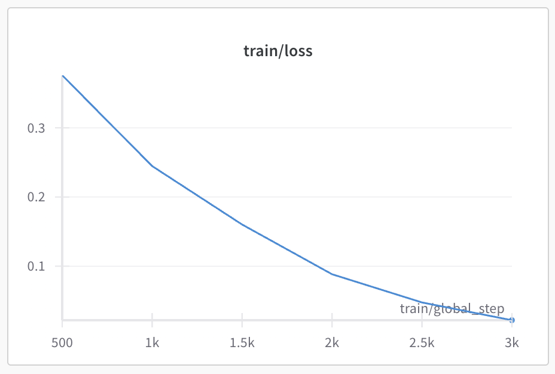
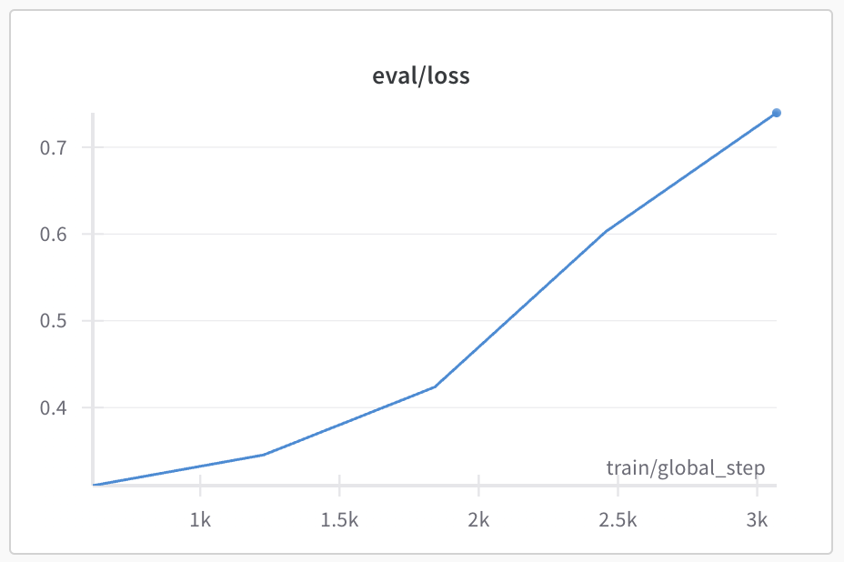
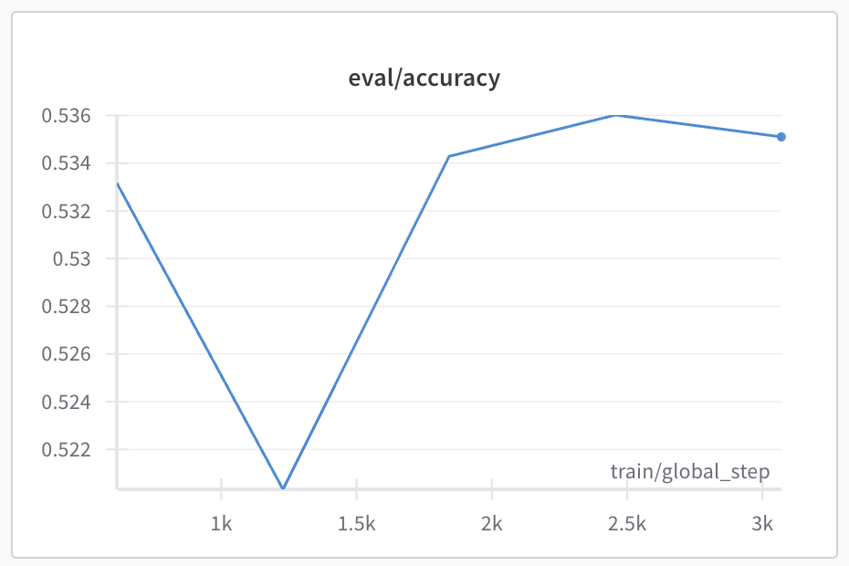

## Week7 Baisc Homework
### wandb 학습 결과 link
- train loss : https://wandb.ai/imsta-hub/Hanghae99/reports/train-loss-25-02-05-22-49-42---VmlldzoxMTIyMjA2NQ
- test loss: https://wandb.ai/imsta-hub/Hanghae99/reports/eval-loss-25-02-05-22-48-40---VmlldzoxMTIyMjA1MQ

### 데이터
- nyu-mll/glue (week4 기본과제)

### 모델 학습
- MNLI 수행
- train의 5%만 사용 (로컬 학습이라 resource 및 시간 문제)
- train 학습은 잘 되었으나 test는 loss가 계속 증가함 -> train dataset 부족으로 overfitting 예상
- accuracy는 0.5 수준으로 유지

#### train loss

#### test loss & accuracy
 

