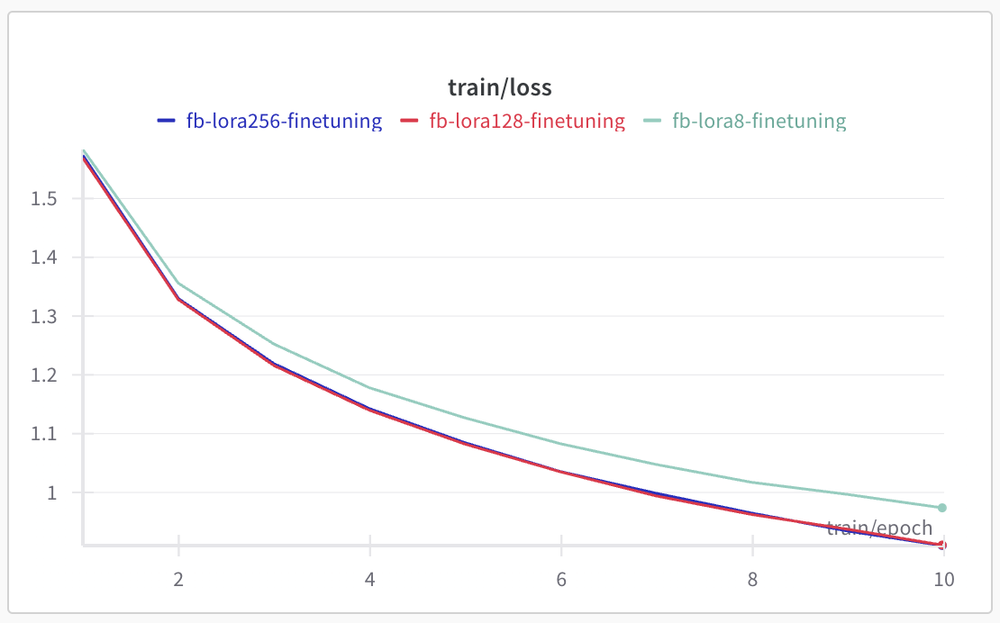
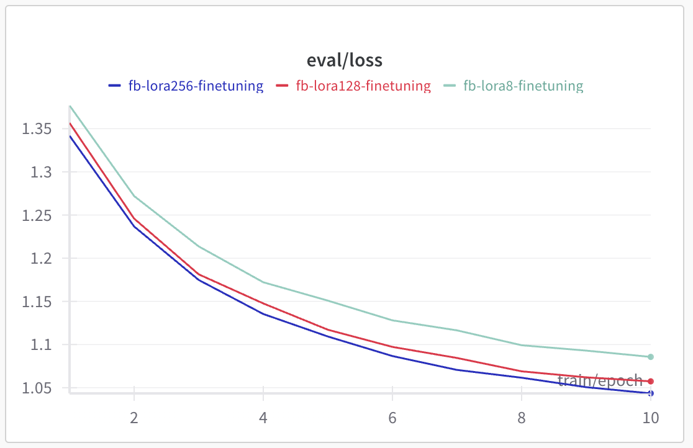

## Week8 Basic Homework
- dataset: sahil2801/CodeAlpaca-20k (lucasmccabe-lmi/CodeAlpaca-20k의 repo 이름이 변경된 것 같음)
- model: facebook/opt-350m
- LoRA 실행 (lora_r: 8, 128, 256)

### lora_r 별 학습 parameter 비교
- 8: trainable params: 3,563,520 || all params: 334,759,936 || trainable%: 1.0645
- 128: trainable params: 57,016,320 || all params: 388,212,736 || trainable%: 14.6869
- 256: trainable params: 114,032,640 || all params: 445,229,056 || trainable%: 25.6121

### wandb 학습 결과 link
- train: https://wandb.ai/imsta-hub/Week8/reports/train-loss-25-02-14-09-22-46---VmlldzoxMTM0NjU3Ng
- vaildation: https://wandb.ai/imsta-hub/Week8/reports/eval-loss-25-02-14-09-21-02---VmlldzoxMTM0NjU2MQ

- 128과 256은 loss 차이가 거의 없기 때문에 간단한 학습이라면 비용을 절약하기 위해 8~128 사이의 값을 사용하는 것이 좋을 것 같음

#### train loss

#### validation loss
