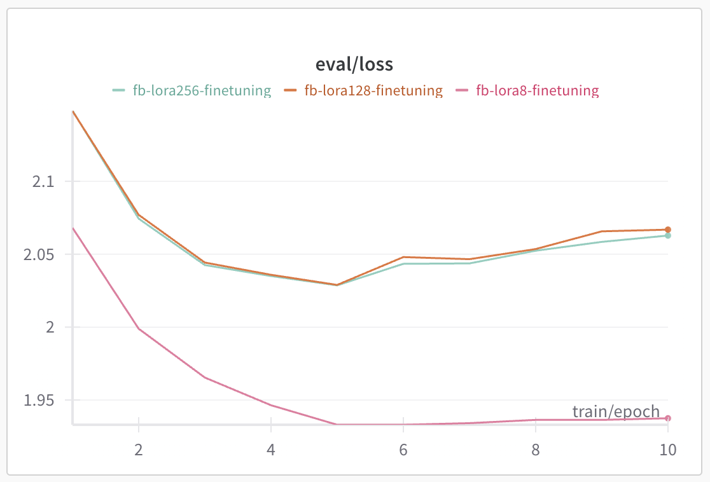

## Week7 Baisc Homework
### wandb 학습 결과 link
- test loss: https://wandb.ai/imsta-hub/Hanghae99/reports/eval-loss-25-02-13-20-23-38---VmlldzoxMTMzNzM4MA

### 데이터
- 자체 학습 데이터: ChatCPT를 사용하여 MapReduce 요약 데이터셋

### 모델 학습
- LoRA 수행
- lora_r 값에 따라 학습해야할 parameter 수 확인
- parameter학습을 제일 적게 한 lora_r=8일 때 loss가 가장 낮음
- train loss는 기록이 안 되었음 (이유를 모르겠음)

#### test loss

